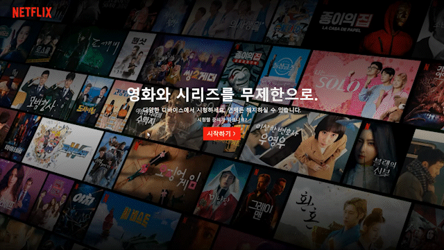
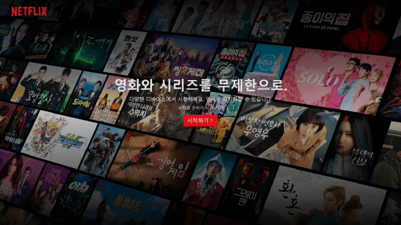
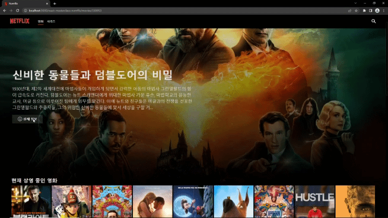
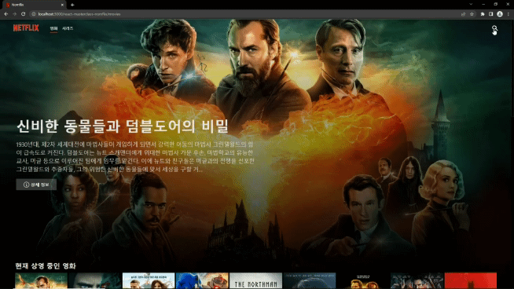

# Nomflix

## [클릭😊](https://lighthearted-cendol-f1db7a.netlify.app/)

## 목적

- react, styled-components, themoviedb api, react query, react router 등을 이용하여 영화와 tv시리즈 정보 조회 사이트 만들기

## 구성

### ▪ 홈

- 인기영화 Top10을 보여주며 화면 양쪽 버튼을 누르면 슬라이드가 동작한다. 
- "더 많은 콘텐츠 보러가기" 버튼을 누르면 /movies로 이동한다.

- 홈 화면이 다음과 같이 변경 되었다. (2022.08.01)

### ▪ 메뉴

- 영화 옆 NETFLIX에 마우스를 올리면 애니메이션이 동작하고 클릭하면 영화 페이지로 이동하게 된다.
- 각 글자를 클릭하게 되면 영화는 영화, 시리즈는 시리즈 페이지로 이동하게 된다.
- 화면 크기가 일정 크기 이하로 작아지면 메뉴 디자인이 달라진다.

### ▪ 영화

- 제일 상단에는 인기영화 1위의 간단한 정보와 상세보기를 할 수 있는 버튼이 있다.
- 양 옆 버튼(< 또는 >)을 누르면 슬라이드가 동작한다.
- 상세보기 버튼이나 영화 포스터를 클릭하면 영화에 관한 상세정보는 확인할 수 있는 창이 나타난다.
- 관련 영상이 있을 경우 관련 영상을 보여주고 없으면 영화 관련 이미지를 보여준다.
- 영화 id에 따라 비슷한 콘텐츠, 추천 콘텐츠를 보여준다.

- 슬라이드 동작이 다음과 같이 변경 되었다. (2022.08.02)

### ▪ 시리즈

- 다른 동작은 영화 페이지와 같지만 시리즈의 경우 상세보기에 시즌과 선택한 시즌에 따라 간단한 에피소드 정보를 보여준다.

### ▪ 검색

- 화면 오른쪽 상단 돋보기 모양을 누르면 검색창이 나타난다.
- 검색어를 입력하면 검색어 알맞는 영화와 시리즈들을 보여준다.
- 포스터를 클릭하게 되면 선택한 콘텐츠의 상제 정보를 확인할 수 있다.

## 느낀점

- styled-components를 사용하여 만들었는데 처음 만들때는 무조건 좋다고만 생각했었지만 이것저것 배우다보니 성능에 좋지 않고 재컴파일이 되어야 하고 비즈니스 로직과 스타일이 뒤엉킨다는 단점이 있다는 것을 알게 되었다. 따라서 각각의 CSS 라이브러리 마다 장단점이 있기 때문에 적절하게 판단하여 사용해야 한다는 것을 배웠다.
- 처음 리액트 배우고 그나마 보여줄만한걸 만든 것이라 좀 코드가 지저분하고 조잡하다. 새로 배운 것이 있으면 업데이트 하고 있지만 부족한 점이 많은 것 같아 지속적인 공부가 필요할 것 같다.

## 개선할 사항

❗ 새로 배운것이나 개선할 방법이 생각나면 계속 추가하여 수정할 예정

- [x] ~~Home 부분 디자인이 너무 구려서 수정 필요~~ (2022.08.01 홈화면 디자인 변경 완료)

- [x] 영화나 시리즈들의 슬라이드를 반응형으로 만들기 → 화면 크기의 변화에 따라 미디어쿼리를 사용하여 조절하려고 했으나 남은 콘텐츠의 수에 따라 동작에 문제가 생겼음. 따라서 화면 크기에 따른 grid 조절과 남은 콘텐츠의 수를 고려하여 슬라이드를 넘길 수 있도록 수정할 필요가 있음(2022.08.02 슬라이드 반응형으로 수정)

- [x] 넷플릭스 처럼 모달창 뒷배경은 고정 되고 콘텐츠 정보가 담긴 모달창만 스크롤 되는 형태로 수정 필요. (2022.06.10 모달창 뒷배경 스크롤막기 추가)

- [x] themoviedb의 경우 한 페이지당 보여주는 콘텐츠 정보가 20개 정도로 적은편. 지금은 1페이지 정보만 받아오는 형태로 구현 되어 있으나 다른 페이지 정보도 받아와서 슬라이드에 콘텐츠 추가할 필요가 있음. (2022.05.13 수정완료)

- [x] 초반에 만들때보다 화면에 보여주는 콘텐츠의 양이 늘어나다보니 API로 불러오는 이미지도 많아졌다. 그 결과 429에러가 발생하는 경우가 생기는데 이럴때 콘텐츠 관련 이미지가 뜨지 않는다. 이부분을 해결해야 할 것 같다.(2022.09.09 수정, 원하는 형태로 완벽하게 동작하는 것이 아니라 차후 수정 필요)

- [x] 리액트 라우터 설정 변경(2023.01.25 변경 완료)

- [x] netlify(2023.01.26 변경 완료, ~~파일명 변경하다가 배포 안되서 고생을 했다.😭~~)

- [ ] localstorage 기능을 사용해서 찜한 콘텐츠 기능 만들기
