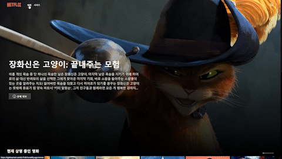
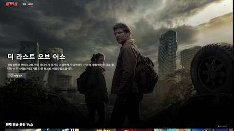

# 넷플릭스 클론

## [클릭😊](https://fabulous-alfajores-b30029.netlify.app)

- 배포는 Netlify를 사용하였다.

### 목적

- React, Styled-components, The Movie Database (TMDB) API, React query, React Router 등을 이용하여 영화와 tv시리즈 정보 조회 사이트 만들기

### 구성

- **홈**

  - "시작하기" 버튼을 누르면 영화 페이지로 이동한다.(일부 디자인이 배포된 사이트와 다를 수 있음!)
  

  
  

- **메뉴**

  - NETFLIX에 마우스를 올리면 애니메이션이 동작하고 클릭하면 영화 페이지로 이동하게 된다.
  - "영화"를 클릭하면 영화 페이지로, "시리즈"를 클릭하면 시리즈 페이지로 이동한다.
  - 화면 크기가 일정 크기 이하로 작아지면 메뉴 디자인이 달라진다.
  

  
  

  

  
  

- **영화 페이지 & 시리즈 페이지**

  - 상단에는 인기 영화 1위와 인기 시리즈 1위의 이름과 overview를 확인할 수 있다.
  - 영화와 시리즈 콘텐츠들을 캐러셀 슬라이드를 만들어 목록을 보여주도록 구현하였다. 만들 당시에는 공부하는 입장이기도 하고 원하는 동작의 구현하는 방식을 찾기 위해 구글링을 많이 했었다. 정말 넷플릭스처럼 깔끔하지도 못하고 자잘한 버그가 있지만 그래도 큰 문제 없이 동작한다. (사실 만들 당시에는 능력자들이 미리 만들어 둔 라이브러리들이 존재하는지 몰랐다...)
  - 상단 상세보기 버튼이나 콘텐츠 이미지를 클릭하면 콘텐츠 상세 페이지로 이동하게 된다.
  

  
  
  

- **콘텐츠 상세 페이지**

  - 콘텐츠의 상세정보를 보여준다.
  - 만약 관련 영상이 있을 경우 관련된 영상을 보여주고 없을 경우 이미지를 보여주며, 둘다 존재하는 경우 이미지와 영상을 토글해주는 버튼을 보여준다.(영상이 유튜브에서 차단 되었거나 삭제되었다면 영상을 볼 수 없다...😢)
  

    
  

  - 추천 콘텐츠, 비슷한 콘텐츠가 있는 경우 콘텐츠들을 보여주며 클릭하면 그 콘텐츠의 상세 페이지로 이동하게 된다.
  

    
  

  - 시리즈의 경우 영화와 다르게 시즌과 에피소드 정보를 추가적으로 보여준다.
  - 시즌이 2개 이상 있을 경우 메뉴로 콘텐츠와 관련된 시즌들을 보여주며, 원하는 시즌을 클릭하면 그 시즌의 에피소드들을 보여준다.
  - 에피소드 runtime이 있을 경우 runtime을 보여주고, 방영 날짜와 오늘 날짜를 비교하여 아직 방영되지 않은 콘텐츠라면 콘텐츠가 방영하는 날짜를 보여준다. 또한 방영 되지 않은 에피소드의 경우 약간 흐리게 처리하였다.
  

    
  	
  

  - 화면의 크기에 따라 에피소드 목록 화면이 달라진다.(❗콘텐츠 상세 페이지뿐만 아니라 다른 페이지들도 나름 반응형으로 구현하였다.)
  

    
  	
  

- **검색**

  - 화면 오른쪽 상단 돋보기 모양을 누르면 검색창이 나타난다.
  - 검색어를 입력하면 검색어 관련된 영화와 시리즈들을 보여준다.
  - 포스터를 클릭하게 되면 선택한 콘텐츠의 상세 페이지로 이동하여 콘텐츠 상세정보를 확인할 수 있다.
  

  
  
  

  - 최근 코드 수정으로 Infinite Queries를 이용해 검색어와 관련된 더 많은 콘텐츠들을 볼 수 있도록 수정하였다.
  

  
  

### 느낀점

- Styled-components를 사용하여 만들었는데 처음 만들때는 그냥 CSS 쓸때보다 편한점이 있어서 무조건 좋다고만 생각했었지만 이것저것 배우다보니 재컴파일이 되어야 하고 비즈니스 로직과 스타일이 뒤엉킨다는 단점이 있다는 것을 알게 되었다. 따라서 각각의 CSS 라이브러리 마다 장단점이 있기 때문에 적절하게 판단하여 사용해야 한다는 것을 배웠다.
- 처음 React를 배우고 그나마 보여줄만한걸 만든 것이라 엄청난 로직이 들어있다던가 그런것은 아니지만 개인적으로 좀 코드가 지저분하고 조잡하다고 생각한다. 새로 배운 것이나 아이디어가 있으면 업데이트 하고 있고 공부를 할수록 부족한 점이 많이 보여 지속적인 공부가 필요할 것 같다.
- TypeScript에 완벽하게 이해하지 못한 상태에서 만든것이라 타입을 엉터리로 쓴 것 같다. TypeScript 공부가 더 필요한 것 같다.
- React Query를 똑바로 사용하지 못한 것 같다 아쉽다. React Query에 대한 정리가 필요할 것 같다.
- 그 전에는 깃허브 배포 기능 밖에 몰라서 깃허브를 이용해 사이트를 배포 했었는데 계속 코드를 수정하면서 Netlify로 배포 방법을 변경하였다. 다양한 배포 방법에 대해 공부를 좀 해봐야 겠다. 그런데 세이프브라우징에 악성 사이트로 잘못탐지 되어 사이트가 차단된 사건도 있었는데 해결 방법을 몰라 배포했던 것을 삭제하고 다시 배포하는 경험도 하였다..😂 만들면서 정말 다양한 경험을 해보는 것 같다.

### 개선할 사항

❗ 새로 배운것이나 개선할 방법이 생각나면 계속 추가하여 수정하는 중!

- [x] ~~Home 부분 디자인이 너무 구려서 수정 필요~~ (2022.08.01 홈화면 디자인 변경 완료)

- [x] 영화나 시리즈들의 슬라이드를 반응형으로 만들기 → 화면 크기의 변화에 따라 미디어쿼리를 사용하여 조절하려고 했으나 남은 콘텐츠의 수에 따라 동작에 문제가 생겼음. 따라서 화면 크기에 따른 grid 조절과 남은 콘텐츠의 수를 고려하여 슬라이드를 넘길 수 있도록 수정할 필요가 있음(2022.08.02 슬라이드 반응형으로 수정)

- [x] 넷플릭스 처럼 모달창 뒷배경은 고정 되고 콘텐츠 정보가 담긴 모달창만 스크롤 되는 형태로 수정 필요. (2022.06.10 모달창 뒷배경 스크롤막기 추가)

- [x] The Movie Database (TMDB) API의 경우 한 페이지당 보여주는 콘텐츠 정보가 20개 정도로 적은편. 지금은 1페이지 정보만 받아오는 형태로 구현 되어 있으나 다른 페이지 정보도 받아와서 슬라이드에 콘텐츠 추가할 필요가 있음. (2022.05.13 수정완료)

- [x] 초반에 만들때보다 화면에 보여주는 콘텐츠의 양이 늘어나다보니 API로 불러오는 이미지도 많아졌다. 그 결과 429에러가 발생하는 경우가 생기는데 이럴때 콘텐츠 관련 이미지가 뜨지 않는다. 이부분을 해결해야 할 것 같다.(2022.09.09 수정, 관련내용은 좀 더 공부가 필요하다.)

- [x] 리액트 라우터 설정 변경(2023.01.25 변경 완료)

- [x] Netlify로 배포하기(2023.01.26 변경 완료, ~~파일명 변경하다가 배포 안되서 고생을 했다.😭~~)
